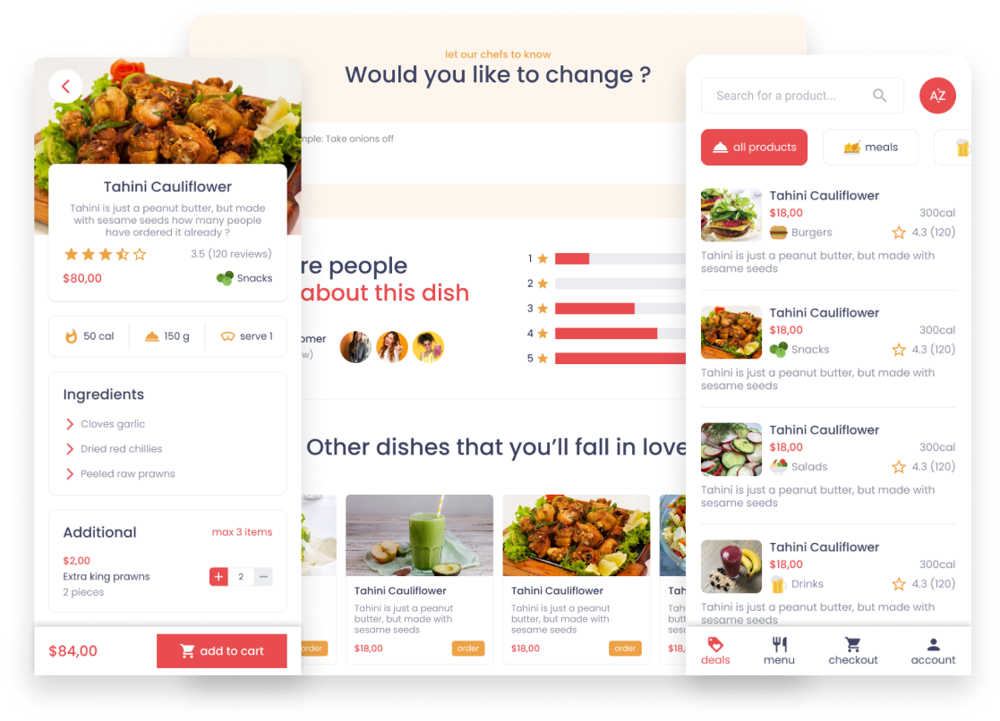
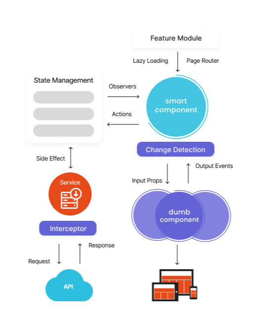

# Restaurant Menu

The idea behind this project is to cover some of the most important functionalities used in Vue 3.

<!--  -->


## Quick Start

Begin by cloning the repository and installing all the required packages. Once completed, initiate the local server. Initially, the application will function using local mock data. You can seamlessly connect it to any API by modifying the interceptor's base URL.

```
> git clone https://github.com/gidmasterlab/restaurant-app-vue
> npm install
> npm start
```

## Vue 3 Approaches

It's essential to leverage the Composition API, which provides a more flexible and scalable way to organize components logic.

Adopting a modular project structure, organizing components, assets, services into well-defined directories to enhances code maintainability and scalability.

- Fundamentals

  - Vite and TypeScript
  - Composition API
  - Reactivity (reactive, ref and computed)
  - Axio (http requests)
  - Pinia (state management)
  - Vuelidate (form validations)
  - Performance tips

- Architecture

  - Variation of responsive and adaptable design
  - Centralizing events with dumb and smart components
  - State management as the primary source of truth
  - Interceptor to standardize API calls and handle errors
  - Featured modules with lazy loading of small chunks
  - Utility functions and services to encapsulate logic
  - Versatile shared components with diverse variations

  

- Styles

  - Scss structure
  - Encapsulated styles
  - Global typography
  - Global colors (palette of colors used in the applciaiton)
  - Consistent paddings and margins across all components

- Pinia

  - Modular state control which provides exclusive hooks to interaction with individual feature states
  - Using setup store (composition API) rather than option store (regular actions and getters)
  - Services interaction using side effect to process API calls

- Axio

  - Centralize API interactions using services
  - Interceptor to standardize API calls and handle errors
  - Handling server issues and redirect to custom error pages
  - Adapter to mock API requests

- Router

  - Checkout page Guard
  - Scroll behavior (scroll page back to the top)
  - Featured modules with lazy loading of small chunks
  - Catch not found routes

- Components

  - View components as main page layout and start point for events
  - Dumb components to display data and respond events back to the smart component
  - Single responsibility principle following patterns to separate concerns in modules
  - Dynamic component to load run-time svg icons (component:is)
  - Async component using defineAsyncComponent

- Utility

  - Format currency and decimals using Intl

- Reactive form

  - Reactive form
  - Vuelidate to validate fields

- Performance (Simple examples)

  - Load dynamic component (defineAsyncComponent and component:is)
  - Render with v-once to guarantee that cards are loaded only once
  - Render with v-memo to watch if categories selection was changed
  - shallowRef used to external interaction with svg's (but it's tipically used to persiste a large amount of data)

## Application Modules

The application was split up in different modules, such as:

- Error

  - Not found
  - Server

- Deals

  - Welcome intro
  - Special dishes
  - Categories shortcut
  - Great deals
  - Food experience

- Menu

  - List all products
  - Search for product name
  - Filter product by category
  - Sort dishes for review, price, calories, name or price.

- Product

  - Product Details
  - Ingredients
  - Reviews summary
  - Additional items
  - Comments
  - Related products

- Checkout

  - Double check product added to cart
  - Remove item form cart
  - Add payment and delivery details
  - Process payment (simulation)

- Shared
  - Buttons, input, dropdown, controller, icons, modal, incremental, review and hero
  - Layouts to organize page sections, divider and containers
  - Grids with scrollable row or vertical view
  - Different type of cards that represent a macro view of the product
